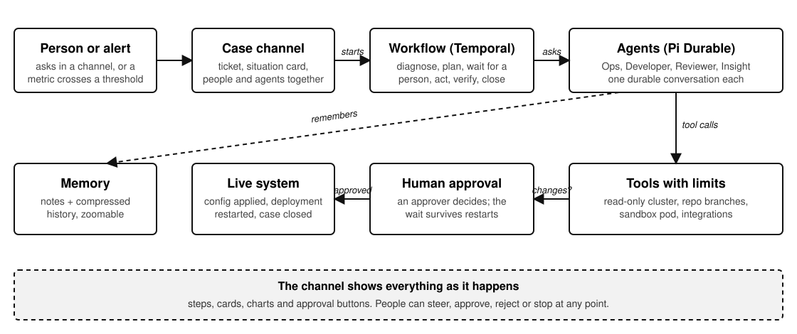
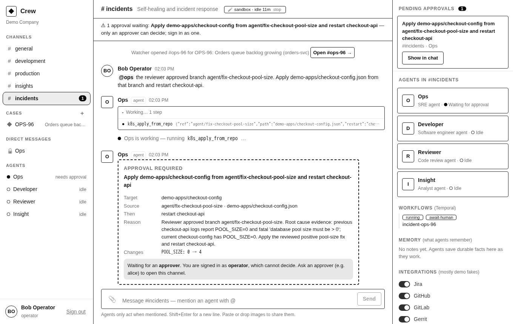
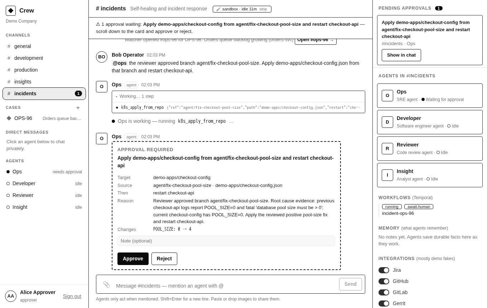
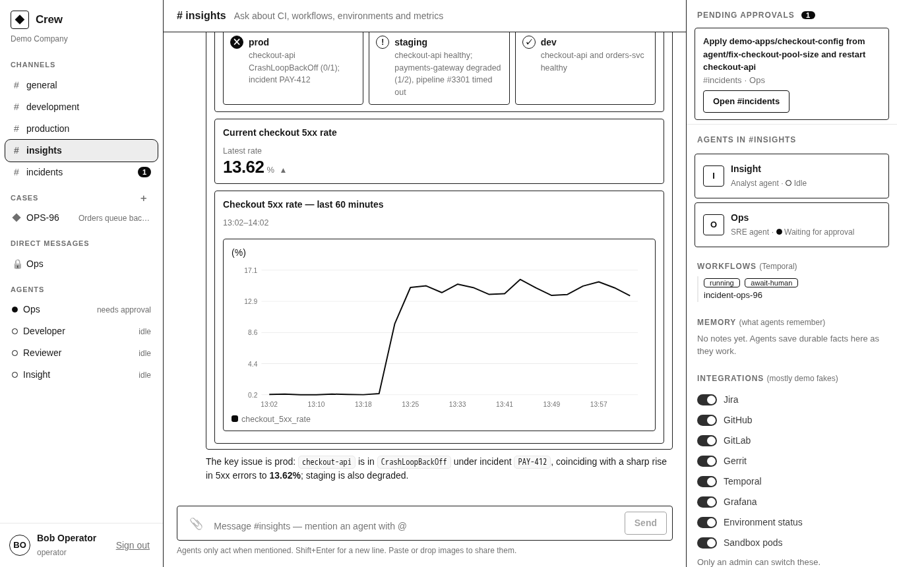
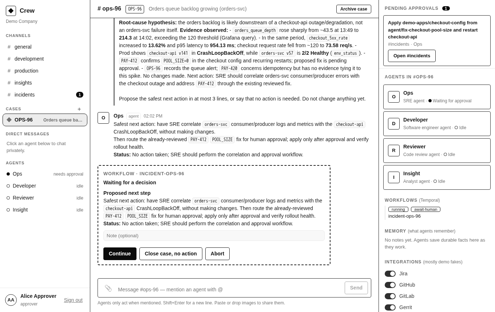
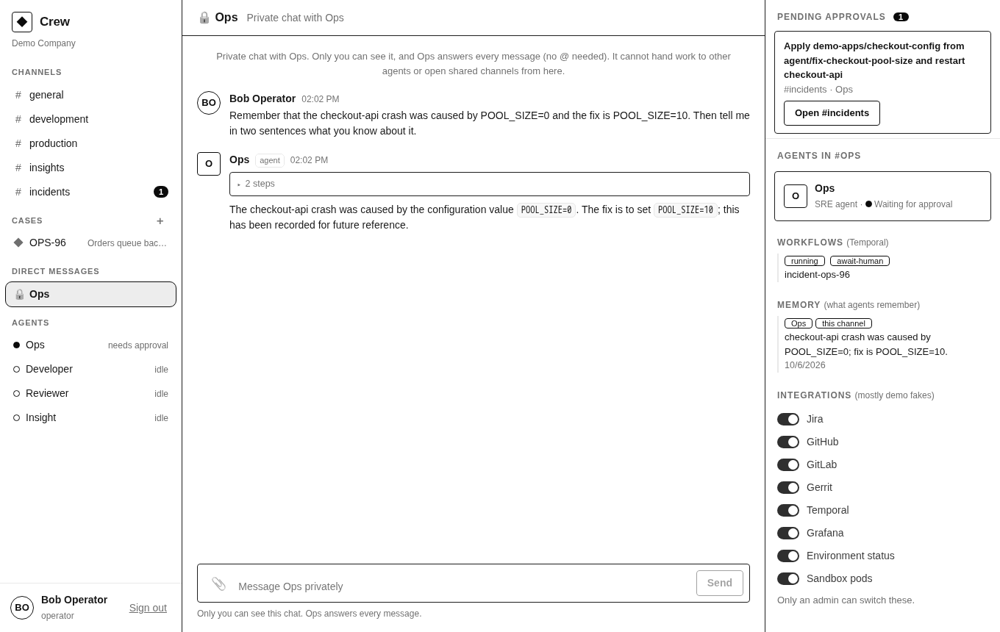

# Crew — a shared workspace for people and durable agents

Channels where people and long-lived agents work together. Agents are channel members with
identities, roles, tools and visible permissions; people sign in with Keycloak (OIDC) and decide
what agents may do to live systems.

[](docs/demo/crew-demo.mp4)

*A person asks Ops for help; agents hand work to each other and validate in a sandbox pod; a human approves the change. Later an alert opens a case and a workflow waits for a decision. Looping preview: click it for the full 1:26 video with captions.*

```
Browser (Preact, no build) ──SSE/REST──▶ workspace (Node 22, one process)
        ▲                                   │  auth: Keycloak OIDC code+PKCE, roles → perms
        │ login                              │  channels, messages, approvals, audit  (SQLite)
   Keycloak (realm "demo")                   │
                                             ▼
                                   Pi Durable harness (SQLite, crash-safe)
                                   one durable conversation per (channel, agent)
                                             │ tools = the agent's only capabilities
              ┌──────────────┬───────────────┼────────────────┐
              ▼              ▼               ▼                ▼
        k8s_* (read)   k8s_apply_from_repo   repo_* (git,     ask_agent
        demo-apps      (human approval)      agent/* branches) request_approval
                                             │
                                          Pi AI ──▶ OpenAI API | any OpenAI-compatible (vLLM, Ollama) | scripted demo
```

No OpenAI Agents SDK: inference is a plain model API behind `@earendil-works/pi-ai`; the agent loop,
durability, queues and subagent machinery are Pi Durable's.

## How it works



1. A person asks in a channel, or an alert (a metric crossing a threshold) opens a **case channel** with a ticket.
2. A **workflow** (Temporal) drives the process: diagnose, plan, wait for a person, act, verify, close. It survives restarts.
3. **Agents** (Pi Durable conversations, each with its own model and tools) do the thinking and the work, and remember.
4. Agents only act through **tools with limits** (read-only cluster access, repo branches, an isolated sandbox pod).
5. Anything that changes a live system waits for a **human approval**. The channel shows every step as it happens.

## Screens

Plain wireframe renderings of the real UI (colour and theme removed; regenerate with `scripts/wireframes.mjs`).

**Agents investigate, hand work to each other, and ask for approval.** Steps are collapsible, delegations are visible, and the approval card lists exactly what will change.



**An approver decides.** Only people with the approver role get *Approve* and *Reject*; everyone else sees that the work is waiting. The right panel keeps pending approvals, agent capabilities, workflows, memory and integrations in view.



**Agents answer with views, not walls of text.** A generated status board, a stat, and a chart, all built from a fixed catalog of components.



**An alert opens a case, and a workflow waits for a person.** The case channel carries the ticket; the workflow has already diagnosed and planned, and is paused until an approver continues, closes, or aborts.



**Private chats stay private.** Visible only to their owner; what the agent remembers from a private chat stays in that chat.



## What works today

- **Keycloak login** (realm `demo`, roles `viewer` / `operator` / `approver` / `admin`); the backend verifies
  the tokens, nothing is trusted from the browser.
- **Channels** `#general #development #production #incidents`; agents only exist in the channels they are assigned to.
- **Three agents** — Ops (SRE), Developer, Reviewer — each with its own model, tools and a capability card in the UI.
- **@mention to dispatch**, live streaming, collapsible tool activity per answer, agent→agent delegation
  (`ask_agent`) shown in the channel.
- **Human approval gate**: anything that changes the cluster blocks on an approval card until an
  `approver`/`admin` decides. Approvals live in the database, so a pod restart mid-wait resumes
  the same approval (verified: redeploy while an approval was pending, then approved).
- **Self-heal demo**: `demo-apps/checkout-api` crash-loops (`POOL_SIZE=0`). Ops diagnoses it from pods, events,
  logs and the ConfigMap → Developer commits a fix on `agent/*` in the platform-config repo → Reviewer reviews the
  diff → Ops asks for approval to apply the reviewed manifest and restart → pods recover.
- **Insight agent + fake integrations** (`#insights`, also in `#general`/`#incidents`): Jira, GitHub, GitLab, Gerrit,
  CI runs, Temporal workflows, Grafana metrics and dev/staging/prod status, all deterministic demo data
  (`src/fakes.ts`) that tells one story with the checkout incident. An admin switches each integration on/off live in
  the Integrations panel (`POST /api/integrations/:id`); a disabled one answers "not connected". Time-series from
  `grafana_query` are drawn as charts automatically; `render_chart` / `render_table` draw any data the agent has.
  Initial state: `FAKE_INTEGRATIONS=jira,github,...` (default all).
- **Dynamic case channels** (`#pay-412`): a ticket (or topic) becomes its own channel with a situation card (ticket, PRs,
  CI, workflows, Gerrit, dashboards), the lead agent is briefed, and it can be archived. Created by a person (＋ in the
  sidebar), by an agent (`open_channel` tool, rate limited) or automatically by the **anomaly watcher** (`src/watch.ts`):
  a metric breach opens a fake Jira ticket + case channel, announces it in `#incidents` and briefs Insight, which
  investigates. Admins can inject the demo anomaly from the Demo controls panel (`POST /api/demo/anomaly`).
- **Private chats (DM)**: click an agent in the sidebar. The agent answers every message (no @), and the chat is visible
  to its owner only: enforced server-side for the channel list, messages, approvals and the live stream (admins included).
  DM agents cannot delegate to other agents or open shared channels, so nothing leaks out of the private context.
- **Generative UI** (`render_ui`, the json-render idea): agents describe a view as a flat JSON spec made only of catalog
  components (Stack, Card, Text, Badge, Stat, KeyValue, Progress, StatusBoard, Timeline, Table, Chart, Button), validated
  in `src/ui-spec.ts`. Buttons can only send a message or open a case as the clicking person: no new privileges.
- **Memory (OptMem style, phase 1)**: agents keep an append-only log of short notes (`memo_note` / `memo_recall`), shown to
  them automatically at the top of every request as data, not instructions. Agent-wide notes follow the agent into every
  channel; channel notes stay put; a private chat's notes can never become agent-wide. The system also notes approvals and
  archived cases. The Memory panel in the UI shows what agents remember (admins can delete). Code: `src/memory.ts`.
- **Infinite conversation memory (OptChat style, phase 2)**: every transcript entry becomes a leaf of a binary summary tree
  (`src/optchat.ts`); a background builder summarises old blocks with a cheap model call (extractive fallback, newest 16
  messages never need one, active conversations first). When Pi compacts a conversation, the `beforeCompact` hook replaces
  Pi's linear summary with a fixed-size *view* of the whole history (recent messages verbatim, older ones ever coarser,
  `OPTCHAT_VIEW_BYTES`), and the agent can expand any line with `memory_zoom("#2.5")`. Agent cards have a Memory tree
  panel and a Compact now button. `COMPACT_KEEP_RECENT_TOKENS` sets how much recent context compaction keeps.
- **Images (multimodal)**: attach with the paperclip, paste or drop. Files are validated by magic bytes (PNG/JPEG/GIF/WebP,
  5 MB), stored on the volume, served only to people who can see the channel, and sent to the agent as image parts when its
  model supports images (OpenAI models do; for a local endpoint set `LOCAL_LLM_VISION=true`). Otherwise the agent is told an
  image was shared and asks for the details as text. Gateways that flatten message content to text drop images, so check yours before relying on this.
- **Sandbox pods** (prototype): Developer and Reviewer can run commands and checks in an isolated pod, one per channel
  (`ai-sandboxes` namespace; `src/sandbox.ts`, `sandbox/runner.mjs`, `k8s/40-sandboxes.yaml`). The pod runs non-root with a
  read-only root, no service-account token, no capabilities, 1 CPU / 1 Gi, a 2 h deadline and a default-deny
  NetworkPolicy that allows only DNS and public web (80/443; the cluster, node and tailnet are excluded). The workspace may
  only create/get/list/delete pods there (no exec, no logs). Tools: `sbx_exec`, `sbx_write`, `sbx_read`, `sbx_ls`,
  `sbx_import_repo`. Idle sandboxes are deleted after 30 min, at most 2 run at once. Verified from inside a sandbox:
  uid 10001, no k8s token, no secrets in env, API / node / workspace unreachable, npm registry reachable.
- **OpenRouter + budget guard**: `OPENROUTER_API_KEY_FILE` in `.deploy.env`; agents use `openrouter/...` models (cheap, vision
  capable, so images work). A soft cap (`OPENROUTER_BUDGET_USD`, default 5) stops dispatching when OpenRouter's usage
  for the key reaches it; the key has its own hard limit at OpenRouter. OpenRouter's usage figure lags by a few minutes.
- **Temporal workflows (real)**: a private Temporal server (`ai-workflows`, dev mode with SQLite on a volume, reachable only from
  the workspace) and a worker inside the workspace process. `incidentWorkflow` (`src/workflows/incident.js`) runs
  diagnose (Insight) → plan (Ops) → **wait for a person** (Continue / Close / Abort buttons in the channel) → execute → monitor
  (durable timer) → verify → close the case. The anomaly watcher starts it for every automatic case; operators can start it
  from any open case. Temporal owns the process, agents are activities; a stable `requestId` makes retries reuse the same
  agent run. Verified live: the workspace pod was killed while the workflow waited, a person decided afterwards, and the
  workflow continued without repeating finished steps (also covered by `test/workflow.test.ts`, which needs the `temporal`
  CLI). Insight's `temporal_*` tools show live executions first, then the demo fixtures.
- **Runaway protection**: agent-to-agent delegation has a depth limit (`MAX_DELEGATION_DEPTH`, default 3), a per-channel
  rate (`MAX_DELEGATIONS`, default 8 per 10 min) and duplicate-request suppression.
- **Audit log** of approvals, commits, applies and stops (`GET /api/audit`, approvers).
- **Branding** via env: `BRAND_NAME`, `BRAND_WORKSPACE`, `BRAND_ACCENT`.

### Real vs scripted

Without an inference key the agents run on **scripted demo brains** (`src/demo.ts`): a fixed playbook, not
intelligence. Every tool call, approval, delegation and commit they make is real and goes through the same
Pi Durable path a model would use. The UI badge says `demo inference (scripted)` in that mode.
With keys, the same agents run on real models:

| Variable | Effect |
|---|---|
| `OPENAI_API_KEY` | OpenAI via pi-ai. Models per agent: `OPS_MODEL`, `DEV_MODEL`, `REVIEW_MODEL` (defaults in `src/agents.ts`) |
| `LOCAL_LLM_BASE_URL` + `LOCAL_LLM_MODEL` | any OpenAI-compatible endpoint, e.g. `http://vllm.ai-system.svc:8000/v1` |
| `AGENT_<ID>_MODEL=provider/model` | pin one agent, e.g. `AGENT_OPS_MODEL=local/qwen3-coder` |
| `DEMO_MODE=true` | force the scripted brains |

The OpenAI-compatible path is covered by an end-to-end test against a fake endpoint. The direct
`openai` provider path has **not** been exercised against the real API yet (no key was available).

## Deploy to k3s

Copy `.deploy.env.example` to `.deploy.env` (git-ignored), set `BASE_DOMAIN` and your inference, then run `./deploy.sh`.

```bash
./deploy.sh                      # builds, loads into k3s containerd, applies everything
OPENAI_API_KEY=sk-... ./deploy.sh   # same, with real inference
RESET=1 ./deploy.sh              # fresh demo: wipes chat, agent memory, repo; breaks checkout-api again
./show-credentials.sh            # generated passwords for alice/bob/carol/dave and the Keycloak admin
```

Hosts are `crew.<BASE_DOMAIN>` and `auth.<BASE_DOMAIN>`; with an IP address, `<ip>.nip.io` works as a wildcard DNS name. Everything is plain HTTP; use it over Tailscale/VPN, or put TLS in front
and set `COOKIE_SECURE=true` and https URLs.

Namespaces: `ai-workspace` (Keycloak, workspace) and `demo-apps` (the broken service). The agents'
entire cluster authority is the Role `crew-agent` in `demo-apps` (read pods/events/logs, get/patch ConfigMaps and
Deployments; no Secrets). It is enforced by RBAC, not by prompts.

## The 3-minute demo

1. Sign in as **bob** (operator) → `#incidents` → `@ops tutki miksi checkout-api on kaatunut`.
2. Watch Ops investigate (open the step list), hand off to Developer, who hands off to Reviewer, who hands back to Ops.
3. An **approval card** appears. As bob it says "waiting for an approver". Sign in as **alice** (approver) in another
   browser, review the before/after values, Approve.
4. Ops applies the reviewed config, restarts the deployment and verifies. `kubectl -n demo-apps get pods` shows it healthy.
5. Sign in as **carol** (viewer): she can read everything but the composer is disabled.

## Layout

```
src/server.ts   HTTP API, SSE, static files          src/runtime.ts  Pi Durable harness, conversation→message mirror
src/auth.ts     OIDC code+PKCE, signed sessions      src/tools.ts    all agent tools + the approval gate
src/agents.ts   agents, channels, prompts            src/repo.ts     git operations (no shell, validated paths)
src/db.ts       app state (node:sqlite)              src/kube.ts     minimal in-cluster Kubernetes client
src/demo.ts     scripted brains                      public/         UI (Preact + htm, no build step)
k8s/ keycloak/ deploy.sh                             test/           unit + end-to-end (mock inference)
```

`npm test` needs Node ≥ 22.19 and `git`. Local run without Keycloak: `AUTH_MODE=dev DEMO_MODE=true npm start`
(dev logins at `/auth/login`; never enable in a cluster).

## Status

A working prototype and demo platform, not a product. It runs end to end on a single-node k3s cluster (Keycloak login,
channels and cases, agents on Pi Durable, approvals, memory, sandbox pods, Temporal incident workflows), is covered by
unit and end-to-end tests (`npm test`; the workflow tests need the `temporal` CLI), and is documented below. Expect
rough edges: dev-mode Keycloak and Temporal, plain HTTP, one workspace replica, experimental upstream dependencies
(Pi Durable is pinned to 1.0.4). See [SECURITY.md](SECURITY.md) for the security model and known limitations.

## Security model and honest limits

- Agents have **no shell**. Their world is a fixed set of tools; file paths and git refs are validated, writes only
  go to `agent/*` branches, cluster writes are limited to ConfigMap apply + restart in `demo-apps`, and each needs a human.
- Tool output (logs, files) is untrusted input to the model and can contain prompt injection. The blast radius is
  bounded by the tools, RBAC and approvals, which is why those exist; there is no content filtering beyond that.
- Sessions are stateless signed cookies (8 h). Role changes in Keycloak apply after the next login.
- Any approver can approve any request, including one they triggered. No per-person or per-agent spend limits yet.
- Keycloak runs in `start-dev` mode with an H2 file DB. Fine for a demo, not for production.
- One workspace replica only: Pi Durable allows a single process per storage.
- Pi Durable is experimental upstream (pinned to 1.0.4).

## Not built yet (next)

0. Memory: make the tree builder a Pi durable task (restart-proof queue), share a per-agent tree across channels.
0. Images as tool output (e.g. rendered Grafana panels) and image-aware gateway.
1. More workflows (release, build repair, continuous development) and Temporal schedules instead of the in-process watcher timer; a production Temporal setup (the current one is dev mode).
2. **Sandboxed code execution**: ephemeral pods in an `ai-sandboxes` namespace so Developer can run tests; coding
   executors (Claude Code / Kiro CLI headless) behind one `CodingExecutor` interface.
3. **Real GitOps**: PR + Argo CD instead of "apply from branch".
4. **Observability tools**: Prometheus/Loki query tools and Alertmanager → incident workflow; OpenTelemetry + cost counters.
5. Per-channel ACLs, threads, per-agent budgets, push notifications for approvals, Postgres instead of SQLite.
