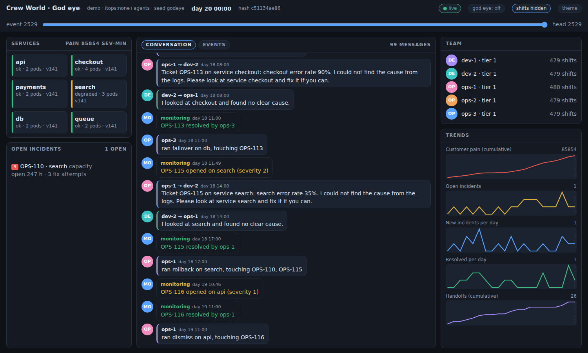
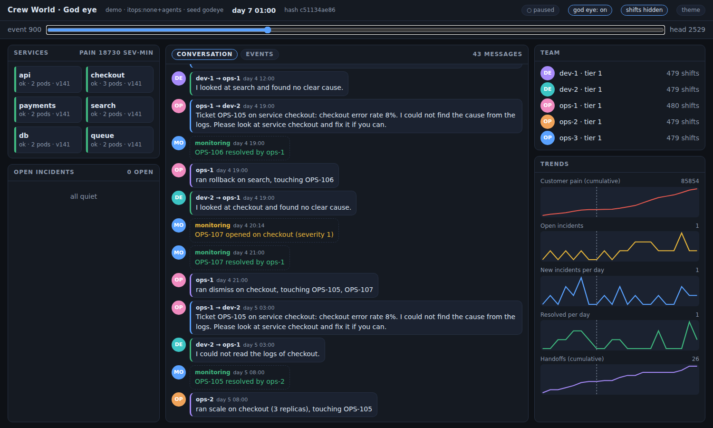

# The god eye: watching a world

```
crew world new demo --spec itops:none --team ops=3,dev=2 --faults heavy --seed godeye
crew world run demo --days 20
crew world watch demo --port 8810        # then open http://127.0.0.1:8810
```

`watch` is a **read-only** view of a world file (the SQLite connection itself refuses writes; a test tries). It works while the world is running (WAL), and on a finished one. It listens on 127.0.0.1 by default and has no login: do not bind it to a public address (`--host`) without something in front of it.



What you see:
- **Services**: each service's real condition (ok / degraded / down), pods, version. Derived from the open incidents, never stored separately.
- **Open incidents**: ticket, service, severity, how long, how many fix attempts. The **god eye** switch adds the hidden cause the agents are never shown.
- **Conversation**: what the agents asked each other (`ops-1 → dev-2`), the answers, the fixes they ran, and what monitoring reported, read from the history.
- **Events**: the raw history (routine `agent.shift` events hidden by default).
- **Time slider**: drag to any event number; services, incidents, conversation and the charts' marker show the world as it was then (state = nearest daily snapshot + the events after it, so it is exact, and cheap even a year in).
- **Team** and **Trends** (cumulative customer pain, open incidents, new and resolved per day, handoffs).



API (all GET): `/api/info`, `/api/view?seq=N[&god=1]`, `/api/chat?since=S&limit=L`, `/api/events?since=S&limit=L[&type=T][&actor=A]`, `/api/series`. Limits are clamped (2000). Code: `src/world/observe.ts` (Observer), `src/world/watch-server.ts`, `src/world/ui/world.html` (one self-contained page, no dependencies).

Not there yet (honest list): control (pause, speed, inject, kill/spawn, forks: that is M5, and needs a writer, so it will be a separate, authenticated thing); a map beyond the six tiles; a chat where a human can talk to an agent in the world; multi-world overview; sound-like polish. The page was checked in a real headless browser (no JS errors, screenshots above), but not on a phone.

## The same world inside the Crew workspace (no second UI)
With `WORLD_AUTORUN=<name>` (deploy: `WORLD_AUTORUN=demo ./deploy.sh`, optional `WORLD_TICK_MS`, `WORLD_TEAM=ops=3,dev=2`, `WORLD_FAULTS=heavy`) the workspace server runs a team world by itself, one virtual day per tick, and mirrors its conversation into the read-only channel **#world-<name>** in the ordinary Crew UI: the same message rows, the same login. In that channel the right-hand panel shows a **World** section (services, open incidents, time slider, charts; operators get a "god eye" switch for the hidden causes). Nobody can post there and no live agent is in it. API: `GET /api/worlds`, `/api/worlds/:name/view[?seq=N][&god=1]`, `/api/worlds/:name/series`, all behind the normal login (`god=1` needs the operator role). Code: `src/world/bridge.ts` (the only place the world touches the live side: it may import only `db` and `hub`, enforced by a test), `src/world/live.ts`. The server is the world's only writer: do not run `crew world run` on the same world at the same time.

### With a language model behind the operators
`WORLD_BRAIN=model WORLD_MODEL=<id> WORLD_BUDGET=<units/day> WORLD_AUTORUN=demo ./deploy.sh` (endpoint and key: the workspace's `LOCAL_LLM_BASE_URL` / `LOCAL_LLM_API_KEY`, the inference gateway). The operators then think with the model, with three cost controls: a **pager** (the model is not consulted when no ticket is open and nobody asked anything: a quiet shift costs zero requests), a **daily budget** in model turns (when spent, that agent falls back to the rule brain for the rest of the virtual day, and the shift is marked `degraded`), and a **tape** (`<name>.tape.jsonl`) so the run can be replayed with zero requests. Every request carries `x-session-id: crew-world:<agent>` because the gateway routes sticky by conversation id. Developers stay rule-based. The first version of this demo used rules only (my choice: free and repeatable); the model is now opt-in per deploy.
